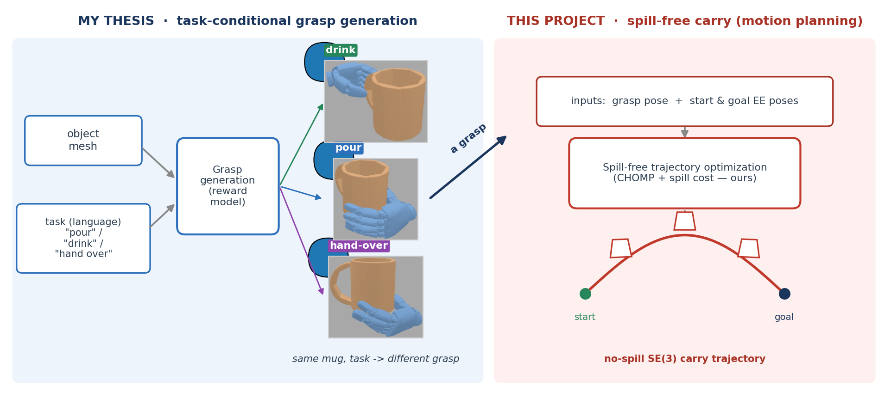

<!-- _paginate: false -->

# Affordance-Grasp Conditioned Spill-Free Trajectory Optimization

Does <b>how you grasp</b> a cup change <b>how safely you can carry</b> it?

 

Motion Planning · Proposal &nbsp; Jihoon Yun · 2026-06-08

---

## Where this project fits — from grasp generation to the carry

<b>My thesis (left):</b> object mesh + a natural-language task → a dexterous grasp (same mug, the task picks a different grasp). &nbsp; <b>This project (right):</b> take that grasp + start/goal poses → plan a <b>spill-free</b> carry trajectory.

---

## Problem — carry liquid from A to B without spilling

Given a grasped mug, plan a 6-DoF end-effector trajectory that is:

- **(a)** spill-free &nbsp;&nbsp; **(b)** obstacle-avoiding &nbsp;&nbsp; **(c)** smooth &nbsp;&nbsp; **(d)** tilt $\le \theta_{max}$

 

**Even a perfectly upright cup spills** under a fast stop or turn — the danger is *motion*, not just orientation.

 

Why? That is the next slide.
