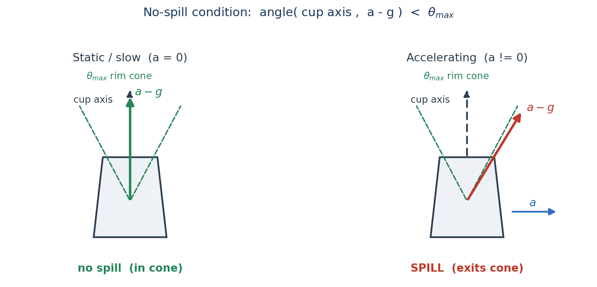
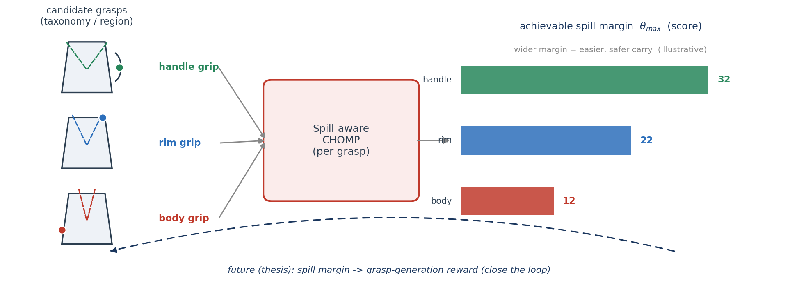

# Affordance-Grasp Conditioned Spill-Free Trajectory Optimization

**Carrying a mug of liquid without spilling**

<b>My thesis:</b> task-conditional dexterous grasp generation — object + a natural-language task (e.g. "pour", "hand over") → <b>how a multi-finger hand should grasp it</b>. <b>This project (motion planning):</b> given such a grasp, plan the <b>carry</b> — and ask whether the grasp choice itself helps.

A fast motion spills the cup even when held perfectly upright — liquid responds to <b>effective gravity</b> $g - a_{ee}$.

Motion Planning · Proposal &nbsp; Jihoon Yun · 2026-06-08

---

## 1. Problem — grasp decides the spill margin

No-spill ⇔ apparent-up $a_{ee}-g$ stays in the cup's <b>rim cone</b> ($\theta_{max}$). The <b>grasp</b> (taxonomy / region — handle vs rim vs body) fixes the hand→cup transform, so it sets <b>how wide that cone is</b> and how much acceleration the carry can afford.

---

## 2. Related Work & Our Difference

| Line of work | What they do | Gap |
|---|---|---|
| Anti-slosh / spill-free planning  Muchacho '22, Gandhi '24 | spill-free trajectory for a **fixed** container pose | grasp is a fixed boundary condition |
| Waiter / non-prehensile  Heins '23, Selvaggio '23 | keep object from tipping/sliding (friction cone) | rigid object, no liquid, no grasp choice |
| Affordance / task-oriented grasping  "Grasping for a Purpose" '14, Dang '12 | pick a task-appropriate grasp | **stops at selection** — never carries it |

Nobody connects grasp choice to a physical spill margin. We make the trajectory optimizer **score grasps** by how safely they can carry → the missing bridge.

---

## 3. Method — Spill-Aware CHOMP as a grasp evaluator

$$
J(\xi) = \underbrace{J_{\text{smooth}} + J_{\text{obs}}}_{\text{course CHOMP (Lec. 8)}} + \;\lambda_s\, \underbrace{J_{\text{spill}}(\xi)}_{\text{ours, differentiable}}
\qquad
\text{\small eval: } \theta_{max}(\text{grasp}) = \text{achievable margin}
$$

<b>This term project:</b> spill cost in CHOMP + 3-way ablation (linear / CHOMP / +spill) on a mug + SAPIEN particle demo, and run it across grasps to show margin differs. &nbsp; <b>1 week.</b> &nbsp; <b>Future (thesis):</b> feed that margin back as a grasp-generation reward — close the loop.
